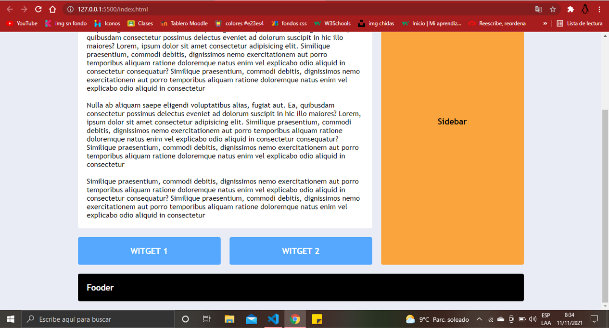

# Sitio web responsivo con CSS GRID
Como sabemos un sitio web bien echo se caracterisa por su responsividad, es decir que se pueda acoplar a las distintas resoluciones de las pnatallas com para las pc, Tablets, Smartphones, etc., a continuación se muestra de dos posibles maneras para lograr hacer la pagia.
### Pagina en toda su extención

### Pagina prueba de la flexibilidad

#### Creacion de las columnas y las filas del contenedor
Primeramente debemos declarar las siguientes propiedades al contendor con`grid-template-columns: repeat(3,1fr);` para definir cuantas columnas queremos y `grid-template-rows: repeat(4, auto);`para definir las filas que contendra el contenedor.

##### 1.- Definir o calcular las columnas y filas a asignar a los elementos-branch: desarrollo
Aqui no se agregan areas solamente se definanlas medidas o mas bien las columnas que se desean y las filas. Ya en las propiedades de los elementos se definen cuantas olumnas tomara dicho elemento.
`grid-column: 1 / -1;` 
aquí decimos que queremos que empieze en la columna 1 y termine en -1, en programación sabemos que eso significa que empieza de forma dessendente.

##### 2.- Creacion de areas-branch: master
Lo que hacemos es crear un area dentro del contenedor y despues envocarlo desde el elemento que deseamos aplicar esa regla. 
###### Creacion del area 
`grid-template-areas: "header header header"`
                         `"contenido contenido sidebar"`
                         `"widget-1 widget-2 sidebar"`
                         `"footer footer footer";`
Lo que hacemos es decirle en que columnas y filas aparecera ese elemento, si queremos que aparesca en las tres columnas ponemos tres veces el mismo elemento.
###### Aplicar el area
solo debemos asignar en las propiedades de los elementos la siguiente linea`grid-area: header;` donde header es el elemento asignado en la creaciòn del area y asi sucesivamente.